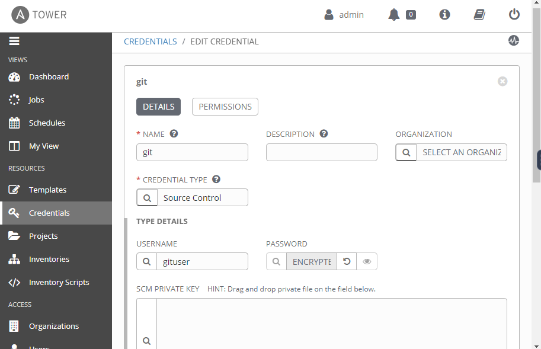

We have preprovisioned 4 VM's Git Server & Jenkins, XL release, Ansible Tower and Client server.

Ansible Tower
===

- Login to Ansible Tower with credentials:  **username:** `admin` , **password:** `password`
- Open credentials tab, Click on the `+` button to add new credentials and enter the follwing details:
- **NAME**: `git`
- **CREDENTIAL TYPE**: `Source Control`
- **USERNAME**: `gituser`
- **PASSWORD**: `password`,
- Click **Enter** button on keyboard after providing password
- Or else Click on **save** to save the details.

##  Open projects tab, Click on the Demo Project and edit the follwing details:

- **SCM URL**:
```
http://gituser@[[ Instruqt-Var key="url" hostname="git-jenkins-server" ]]/project.git
```
- **SCM CREDENTIAL**: `git`

- Click on **Save**
##  Open Templates, Click on the Demo job template and edit the follwing details:
- Clicimage.pngk on **PLAYBOOK** dropdown and select the playbook (demo_playbook.yml)

- As of now we had a demo_playbook.yml pushed in repo, So Add it to Start the **JOB** using the **Template**


XL release steps
===

- Open  **XL release** in **tabs** with credentials:  **username:** `admin` , **password:** `admin`
- click on **folder**
- click on **Samples & Tutorials**

- Click on **template** with named **Applications/XL_Test**  which we have created as a sample template
- Now click on **Jenkins task** which is added already.

- Now click on `Config`.
- **Select Server**:  `Jenkins Server` from dropdown menu
- **Job**: `JenkinsTestJob`


Now close the window.

**Next we need to  create a trigger**.

- Click on **Triggers** in left side panel.

- Click on Add **Trigger**.
- Update the mandatory fields like **Title**,
- Select **trigger type** as `Git: Poll`,
- **Pole interval** : `5`,
- Select your **Repository** (here we have created a Git connection with name `Git Server`).
-  **Branch**: master


- Select your **template:** Applications/XL_Test and  **folder:** Samples & Tutorials
- Enter mandatory field **Release Title** (as per your choice)
- **click** on Save


 Workflow
===

Go to the **Shell_local** tab
- cd project/
- Make some changes in `demo_playbook.yml`  using
```
vi demo_playbook.yml
```
After you made changes, then push to the git server
```
git add .
git commit -m "First commit"
git push origin master
```

Now check the flow on XL release, Jenkins and Ansible Tower.
Open  **Jenkins** in **tabs** with credentials:  **username:** `admin` , **password:** `admin`
XL release trigger jenkins when there is a commit in git repo, jenkins builds job and deploys to ansible tower.

Outputs should look like:
- In **Jenkins:**

- In **Ansible:**
**Jobs:**

**Dashboard:**

- In **XL Release:**
